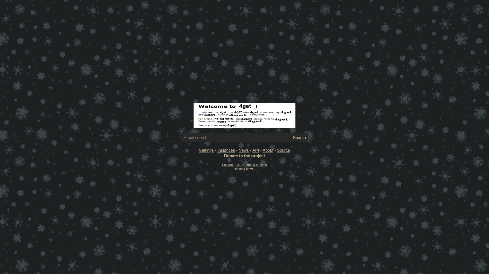
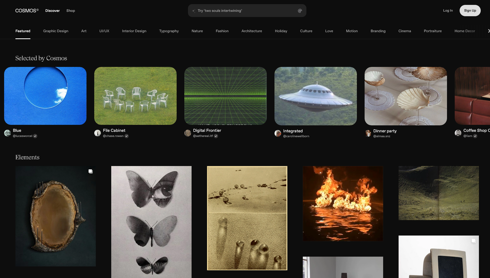
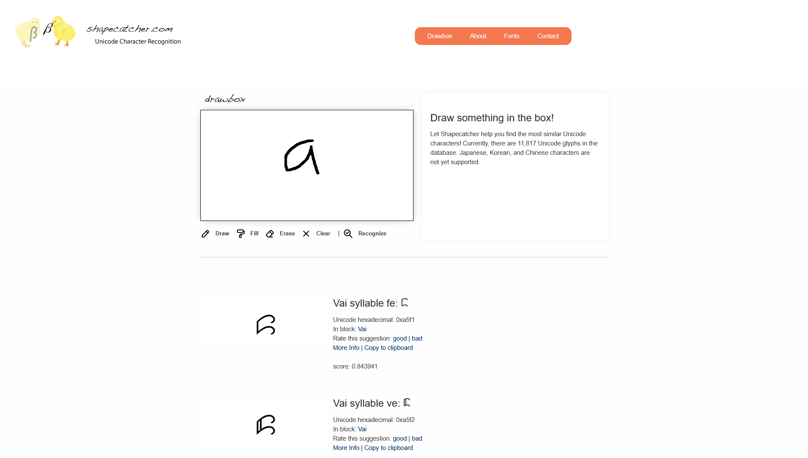
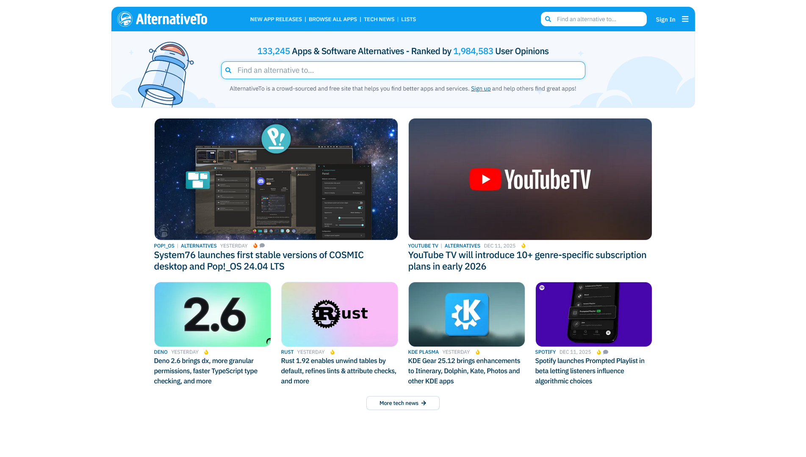

# awesome-elliot

### Användning
- [Hemsidor](#verktyg)
  - [Verktyg](#verktyg)
  - [Sökmotorer](#sökmotorer)
  - [Sök](#sök)
  - [Webbverktyg](#webbverktyg)
  - [Listor](#listor)
  - [Assets](#assets)
  - [Pirat](#pirat)
      - [Guider](#guider)
      - [Streaming](#streaming)
      - [Nerladdning](#nerladdning)
  - [Extensions](#extensions)
  - [VST](#vst)
  - [Blender](#blender)
  - [Appar](#appar)
  - [Program](#program)
  - [Hemsidor](#hemsidor)
  - [Forum](#forum)
  - [Gallerier](#gallerier)
  - [Bloggar](#bloggar)
### Nöje
- [Program](#Program)
- [Hemsidor](#Hemsidor)
- [Forum](#Forum)
- [Gallerier](#Gallerier)
- [Bloggar](#Bloggar)

#

## Verktyg

- [Localsend](https://localsend.org) - 🐐 Skickar filer lokalt till och från alla enheter
  

  

  
  

- [Gaea](https://quadspinner.com/Gaea/) - Terränggenerator med noder
- [Affinity](https://www.affinity.studio) - Nyligen gratis alternativ till Photoshop, Illustrator och Indesign
- [MediaHuman](https://www.mediahuman.com/) - Multimediaprogram
- [7zip](https://www.7-zip.org/) - Zip program
- [Shutter Encoder](https://www.shutterencoder.com/) - Video och ljud konverterare
- [Beat](https://www.beat-app.fi/) - Manusskript program
- [Amphetamine](https://apps.apple.com/us/app/amphetamine/id937984704?mt=12) -  Håller Mac från att slockna
- [fSpy](https://fspy.io/) - 3D kameramatchning
- [BeeRef](https://beeref.org/) - Referenshantering
- [PrivaZer](https://privazer.com/) - Tar bort allt onödigt skräp i Windows förutom hela operativsystemet
- [Element](https://kushview.net/element/) - VST plugin host
- [BorisFX Silhouette](https://borisfx.com/products/silhouette/) - Roto nod program
- [WizTree](https://diskanalyzer.com/) - Träd av filer för lagring
- [SoundQ](https://www.prosoundeffects.com/soundq) - Alla royalty free ljud från freesound.org och andra i ett program
- [Srtly](https://github.com/patricksthannon/Srtly) - Mac fil auto organisering
- [VERT](https://vert.sh/) - Fil konvertering

## Sökmotorer
- [Marginalia Search](https://marginalia-search.com/) - Sökmotor som prioriterar icke-kommersiellt innehåll
  

  

  

  
  

  

  

- [4get](https://4get.ch/instances) - Sökmotor som troligen inte vill döda mig

## Sök
- [Cosmos](https://www.cosmos.so/home) - 🐐 Bra hemsida för inspiration och referens
  

  

  
  

- [Same Energy](https://same.energy/) - Visuell bildsökmotor
  

  

  
  

- [Shapecatcher](https://shapecatcher.com/) - Kan hitta Unicode karaktärer genom att rita
  

  

  
  

- [In Different Language](https://www.indifferentlanguages.com/) - Ord på andra språk
  

  

  
  

- [The Word Finder](https://www.thewordfinder.com/wordlist/) - Ord som börjar eller slutar på...
  

  

  
  

- [Alternative Spelling](https://datayze.com/alternate-spelling-finder) - Andra sätt att stava ord
  

  

  
  

- [Word Unscrambler](https://www.wordunscrambler.net/) - Hittar ord i ord
  

  

  
  

- [Track Awesome List](https://www.trackawesomelist.com/) - Dagliga uppdateringar om awesome listor
  

  

  
  

- [OSS Insight](https://ossinsight.io/) - Live insikt i open source utveckling
  

  

  
  

- [TV Tropes](https://tvtropes.org/) -  Alla tänkbara troper för allt
  

  

  
  

- [AlternativeTo.net](http://alternativeto.net) - Hitta alternativ
    

    

 
  
  

## Webbverktyg
- [Youglish](https://youglish.com/) - Vad du än skriver i linjer i youtube videor
- [Brandfetch](https://brandfetch.com/) - SVG filer för massa företag
- [TextFX](https://textfx.withgoogle.com/) - Maskininlärningverktyg för rap
- [RapPad](https://www.rappad.co/) - Rap anteckning och freestyle
- [AZRhymes](https://azrhymes.com) - Rimlexikon på Svenska
- [Squoosh](https://squoosh.app/) - Bildkomprimering
- [StackEdit](https://stackedit.io/) - Markdown editor

## Listor
- [Lists](https://github.com/jnv/lists) - Listor av listor av listor av listor av listor av listor av listor
- [awesome](https://github.com/sindresorhus/awesome) - Officiella awesome
- [awesome-awesomeness](https://github.com/bayandin/awesome-awesomeness) - awesome lista av awesome listor
- [#awesome](https://github.com/topics/awesome) - awesome listor på github
- [awesome-design-tools](https://github.com/goabstract/Awesome-Design-Tools) - Design verktyg
- [awesome-windows](https://github.com/0pandadev/awesome-windows) - Windows program
- [awesome-mac](https://github.com/jaywcjlove/awesome-mac) -  (shift-option-K)
- [awesome-websites](https://github.com/StanForever/awesome-websites) - Hemsidor
- [awesome-useful-websites](https://github.com/atakanaltok/awesome-useful-websites) - "användbara" hemsidor
- [Awesome-music-production](https://github.com/ad-si/awesome-music-production) - Musikproduktion
- [awesome-blender](https://github.com/agmmnn/awesome-blender) - Allt Blender
- [awesome-cg-vfx](https://github.com/cgwire/awesome-cg-vfx-pipeline) - CGI och VFX
- [Open Source Software List](https://docs.google.com/document/d/1yNXpuy5tVP0q-El0DqoY-AwmPHT6K09NEZG-Pf0KJ7E/edit?tab=t.0) - Stort dokument med open source program
- [delightful-creative-tools](https://codeberg.org/ADHDefy/delightful-creative-tools) - Kreativ mjukvaro-index
- [Pixelated Pathways](https://courage-1984.github.io/pixelated-pathways/) - Internet saker

## Assets
- [Pexels](https://www.pexels.com/) Stock bilder och videor
- [Pixabay](https://pixabay.com/) - Stock bilder och videor och illustrationer och musik och ljudeffekter och 3D modeller och GIF:ar
- [Bandlab Sounds](https://www.bandlab.com/sounds/) - Samples
- [ActionVFX Practice Footage](https://www.actionvfx.com/practice-footage) - 🐐 NICE
- [BBC sound effects](https://sound-effects.bbcrewind.co.uk/) - Gratis ljudefekter
- [ambientCG](https://ambientcg.com/) - 🐐 Material
- [Poly Haven](https://polyhaven.com/) - Modeller, Material och HDRIs
- [Tracking Plates](https://www.hollywoodcamerawork.com/tracking-plates.html) - Tracking problem
- [Green Screen Plates](https://www.hollywoodcamerawork.com/green-screen-plates.html) - Green screen problem

## Pirat

- [Virgil Search](https://virgil.samidy.com/) - Sökmotor

#### Guider
- [r/piracy Megathread](https://old.reddit.com/r/Piracy/wiki/megathread) -  Säkra källor 
- [Champagne Wiki](https://Champagne.pages.dev/) -  Allt
- [awesome-piracy](https://github.com/Igglybuff/awesome-piracy)
- [freemediaheckyeah](https://fmhy.net/) - 🐐 Allt gratis
- [GenP](https://github.com/Cur10s1tyByt3/GenP) - Adobe
- [The Piracy Glossary](https://rentry.org/The-Piracy-Glossary) - Pirat termer
- [Audioz.download](https://audioz.download/) - VST Forum

#### Streaming

- [Rivestream](http://rivestream.org) - Ful men pålitlig streaming
- [Cinemaos](https://cinemaos.live/) - Snygg men opålitlig streaming
- [Cineby](https://www.cineby.gd/) - Snygg och pålitlig?

#### Nerladdning
- Team R2R - Davinci Resolve
- [G MEH](http://g-meh.com) - VSTs
- [Ocean Of PDF](https://oceanofpdf.com/) - Sketchy
- [Online Courses Club](https://online-courses.club/) - Kurser
- [Annas Archive](https://annas-archive.org/) - Alla böcker
- [libgen.li](http://libgen.li) - Alternativ till annas arkiv
- [Team V.R](https://codec.kyiv.ua/releases.htm) - Nice
- [FileCR](https://filecr.com/us-en/) - Typ säkert
- [Appdoze](https://appdoze.net/) - Verkat säkert (välj gofile)
- [Annas Archive](https://annas-archive.org/) - Alla böcker
- [vfxmed](https://www.vfxmed.com/category/blender/) - Massa VFX
- [1337x](https://1337x-status.org/) - Torrent

## Extensions
- [Tab session manager](https://addons.mozilla.org/en-US/firefox/addon/tab-session-manager/) - Sparar tabs
- [Allow Right-Click](https://addons.mozilla.org/en-US/firefox/addon/re-enable-right-click/) -  Låter en alltid spara bilder med högerklick
- [Tampermonkey](https://addons.mozilla.org/en-US/firefox/addon/tampermonkey/) - Mixterapa
- [Greasy Fork](https://greasyfork.org/en) - Flottig gaffel
- [Gesturefy](https://addons.mozilla.org/en-US/firefox/addon/gesturefy/) - Coolt om man orkar lära sig
- [Stylus](https://addons.mozilla.org/en-US/firefox/addon/styl-us/) - Themes och CSS redigerare för hemsidor
- [Vimium](https://addons.mozilla.org/en-US/firefox/addon/vimium-ff/) - Allt med tangentbord

## VST
- [Kilohearts](https://kilohearts.com/products/kilohearts_essentials) - Massa gratis effekter
- [Shaperbox](https://www.cableguys.com/shaperbox) - Gör typ allt
- [BL Denoiser](https://plugins4free.com/plugin/3618/) - Denoiser
- [Airwindows](https://www.airwindows.com/consolidated/) - Fult men fullt

## Blender
- [Autocam](https://extensions.blender.org/add-ons/autocam/) - Kamera med stil
- [Bool Tool](https://extensions.blender.org/add-ons/bool-tool/) -  Bool och cutter

## Appar
- Kinnu - Man kan typ lära sig allt och det är gratis
- Yamera - Raw kamera app
- Omniscient - 3D track med Iphones magi
- Chet - Pitch träning

## Program
- [Mini.cur](https://github.com/Coulle/Mini-Cursor) - Litet liv
- [TimeSnapper](https://www.timesnapper.com) - Timelapse och statistik av datorbruk
- [Equinox 3D](http://www.equinox3d.com/index.html) - Niche 3D program
- [Feather client](https://feathermc.com/) - Minecraft klient som låter en hosta en server med proxyadress
- [Hakuneko](https://hakuneko.download/) - Laddar ner manga
- [Mechvibes](https://mechvibes.com/) - Tangentbordljud
- [eDEX-UI](https://github.com/GitSquared/edex-ui) - Ironman typ terminal UI
- [Cool Retro Term](https://github.com/Swordfish90/cool-retro-term) - Cool retro terminal
- [ShaderGlass](https://github.com/mausimus/ShaderGlass) - CRT effekter
- [RetroVisor](https://github.com/dirkwhoffmann/RetroVisor) - ShaderGlass för Mac och cool

## Hemsidor
- [wiby](https://wiby.me/) - Sökmotor för gamla hemsidor
- [Gizoogle](https://www.gizoogle.net/) - Google gang
- [Neocities](https://neocities.org/browse) - Självständiga hemsidor
- [MajorGeeks](https://www.majorgeeks.com/) - Windows prylar
- [v86](https://copy.sh/v86/) - OS emulering
- [EarthCam](https://www.earthcam.com/) - Live kameror
- [Radio Garden](https://radio.garden/) - Karta av radio rund världen
- [Raddle](http://raddle.me/) - Reddit tredje part klient
- [YTCH.TV](http://ytch.tv) - Youtube fast som TV
- [Uncyclopedia](https://en.uncyclopedia.co/wiki/Main_Page) - Wikipedia?

## Forum
- [Pixel Joint](https://pixeljoint.com/) - Pixel art community
- [OpenGameArt Forums](https://opengameart.org/forums/art-discussion) -  Allt om spelskapande
- [28chan](https://www.28chan.org/board/) - Baserat
- [22chan](https://22chan.org/) - Bara baserat
- [Something Awful](https://forums.somethingawful.com/) - Gammalt
- [FreddysHouse](https://forums.freddyshouse.com/) - Fredds Hus
- [psymusic uk](https://www.psymusic.co.uk/forum//) - Psykedeliska underjorden
- [Gardeners Corner](https://www.gardenerscorner.co.uk/) - Dem trodde dem var säkra
- [German Car Forum](https://www.germancarforum.com/) - Jag trodde jag var säker
- [survivalmonkey](https://www.survivalmonkey.com/) -  Jag är inte säker
- [Pirates Ahoy!](https://www.piratesahoy.net/) - Riktiga pirater
- [Gaming Masters](https://www.gamingmasters.org/) - Gaming mästare
- [blenderartist.org](https://blenderartists.org/) - Blender
- [teknik-bubblan](https://bubblan.teknikveckan.se/) - Svensk teknik forum
- [Gaming Latest](https://gaminglatest.com/) - Senaste gamering
- [comfybox](https://comfybox.floofey.dog/) -  Vill rädda internet
- [ForumDirectory](https://www.forumdirectory.com/) - Engelsk forum kollektion
- [Svenskaforum](https://www.svenskaforum.com/) - Svenska forum kollektion

## Gallerier
- [Newgrounds](https://www.newgrounds.com/)
- [OpenGameArt](https://opengameart.org/) 
- [The Spriters Resource](https://www.spriters-resource.com/)
- [The Models Resource](https://models.spriters-resource.com/)
- [The Texture Resource](https://textures.spriters-resource.com/)
- [The Sounds Resource](https://sounds.spriters-resource.com/)
- [Frutiger Aero Archive](https://frutigeraeroarchive.org/) - Frutiger Aero sida med Frutiger Aero saker
- [GifCities](https://gifcities.org/) - Geocities Gifs
- [Creative Uncut](https://www.creativeuncut.com/game-art-galleries.html) - Concept art bibliotek
- [Web Design Museum](https://www.webdesignmuseum.org/) - Historia och bilder av hemsidor genom tiden
- [Copypastatext](http://copypastatext.com) - Viktig hemsida för information
- [RinkWorks](http://www.rinkworks.com/) - Smart man

## Bloggar

- [Art of VFX](https://www.artofvfx.com) - Intervjuer med VFX avdelningar
- [No Film School](https://nofilmschool.com) -  Filmskaparnyhetssida
- [Voodoo film](https://www.voodoofilm.org) Filmskaparnyhetssida på svenska
- [ooh.directory](https://ooh.directory/) - Blog kollektion
- [IndieBlog](https://indieblog.page/) - Hittar bloggar på indieweb

Inte adderat:
Monter.is monter group
screencaps
